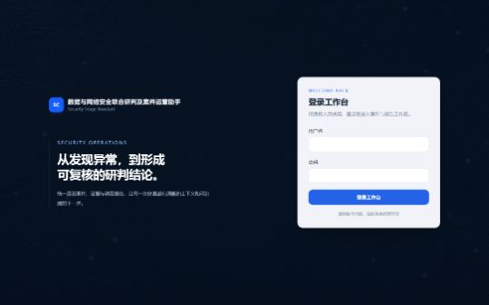
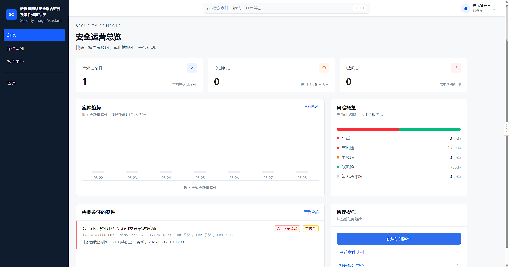
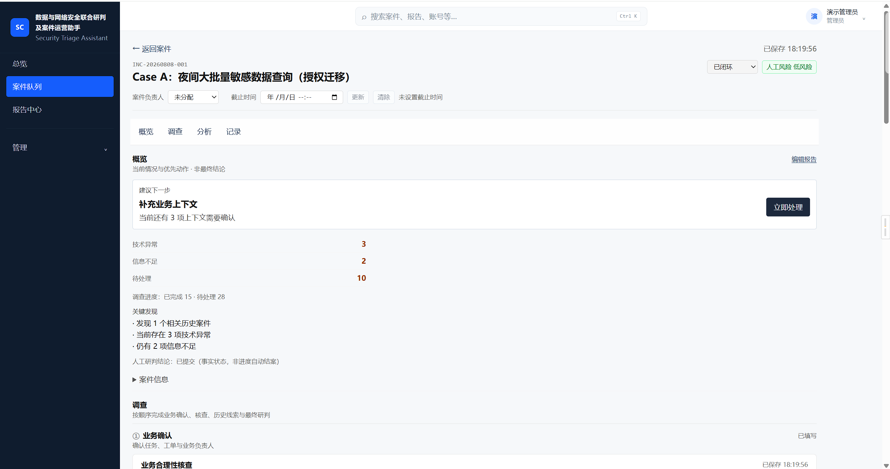

# Security Triage Assistant

数据与网络安全联合研判及案件运营助手。

当前稳定版本：**v1.12.0**（**hardened single-node deployment MVP**）。

**v1.12** 主题：**Deployment & Production Readiness**（部署 / 运行时工程，不是新的安全检测引擎）。

Highlights：

- 可靠的 migrate-before-start 生产启动门禁
- `/api/health`（存活）与 `/api/ready`（DB/schema 就绪）
- 生产环境校验与响应头安全基线
- 单节点登录限流（Better Auth 进程内）
- 非 root 生产 Docker 镜像与持久化 SQLite volume（`/data`）
- 已校验的 SQLite 备份 / 恢复（`VACUUM INTO` + integrity）
- Rollback / DR 运维指引与最小结构化运维日志
- Docker CI smoke

v1.12 明确边界：

- **不是** fully production-ready enterprise platform
- **不是** HA / multi-replica / PostgreSQL / Kubernetes / Redis / 分布式限流
- **不改变**确定性安全分析、HumanReview、Case Operations、风险、Checklist 或报告语义

产品能力叠于 v1.11 Case Operations 与既有认证、合规知识、告警导入、Investigation Workbench、关联历史、Leads、Comparison 与 Checklist 之上。

## 界面预览

以下截图使用合成演示数据，仅用于展示界面与信息层级；截图已移除浏览器地址栏、服务器地址和真实业务数据。







部署、镜像源和运行时检查等运维细节请参阅[内网部署文档](docs/DEPLOYMENT.md)。

## 一、项目是什么

本工具帮助安全人员在**已有安全平台告警之后**完成：

导入 → 标准化 → 多维辅助研判 → 业务合理性核查 → 证据与核查清单 →
人工结论 → 案件持续管理 → 操作审计与交接 → 报告编辑 → 导出可编辑 Word（DOCX）

目标：连接已有安全平台产生的信息，支持导入、标准化、多维辅助研判、业务核查、
人工结论、案件持续管理、报告、操作审计与交接班。

**不是** SIEM / SOC / IDS / NDR / DLP / 漏洞扫描器 / 日志采集平台 / SOAR 的替代品。
默认企业已经存在成熟的安全检测产品；本项目只做研判、案件运营与报告整理。

## 二、解决的问题

已有安全平台：负责检测并产生告警。

本工具负责：

- 导入（手工 / CSV / 文本粘贴 / JSON 单条告警）
- Wazuh JSON 确定性字段映射（JSON adapter，**不是** Wazuh/SIEM 直连）
- 签名 Wazuh Webhook 接入（HMAC-SHA256 + 时间戳防重放；密钥由运行环境注入）
- 原始告警元数据查询与筛选（来源 / 接入状态 / externalAlertId；默认不回显原文）
- 原始告警详情查看（权限保护、仅展示已脱敏副本，载荷默认折叠且不提供下载）
- 字段标准化与人工确认（不自动创建 Case）
- 数据 / 网络 / 身份联合辅助研判（含 Golden Case 规则基线）
- Case Investigation Workbench（概览 / 下一步 / 证据与核查 / 人工研判）
- 关联历史案件（确定性共同调查事实；30 天窗口 / 最多 5 条）
- Historical Signals + Investigation Leads（重复事实汇总与建议核查）
- Case Comparison Workspace（双案对比：共享/差异事实；历史研判只读参考）
- Investigation Lead → Analyst opt-in Checklist（provenance / dedup / Audit）
- 业务合理性核查（工单 / 负责人确认）
- Evidence / Checklist / Timeline
- 人工最终结论（HumanReview）
- 案件持久化与历史跟踪
- 案件负责人与「我的 / 未分配」队列（Analyst 自助接手 / 释放；Admin 指派）
- 运营截止时间与逾期 / 今日到期 / 即将到期可见性
- 确定性「截止优先」队列排序（可与范围 / 搜索 / 状态 / 风险组合）
- 操作审计、最近活动与交接说明
- 报告草稿持久化与 DOCX 导出

**v1.10 明确不做：** AI / 概率关联、自动合并案件、自动写入 Checklist、自动提升当前风险、攻击归因；Dark Mode / 主题系统 / 设计系统包 / 图表 Dashboard。

## 三、v1.2 新增

- `CaseAuditLog` 案件操作审计
- Semantic Command（语义业务动作）
- 操作审计与 Activity Feed
- 最新交接（Handoff Note）
- `lastActivityAt`（与 `updatedAt` / `reportUpdatedAt` 分离）
- 报告创建 / 更新 / 导出审计
- `operationId` 幂等
- stale 防覆盖（案件 snapshot / 报告草稿）

## 四、技术栈

- Next.js（App Router）+ TypeScript + Tailwind CSS
- Prisma ORM 7 + SQLite（本地 Demo）
- Better Auth 1.6.x（username + password；Database Session）
- Vitest
- docx（原生可编辑 Word）

### v1.4 合规知识（Case 集成）

- 研判命中规则 → Control → Clause 关联参考（只读辅助，非违法认定）
- 报告创建时固化 Snapshot；知识库后续更新不改写已有草稿
- 建议核查事项可 opt-in 写入现有 Checklist；**不会**因规则命中自动批量写入
- GB/T 22239 仅 SUMMARY_ONLY；官方链接来自 pack provenance + allowlist
- **未包含：** 独立知识中心浏览 UI、规则库扩至 25–30、RAG/PDF 全文

详见 `docs/v1.4/RELEASE_CHECKLIST.md`。

### 开发登录（v1.3+）

`npm run db:seed`（非 production）会幂等创建 Demo Users：

| username | role |
| --- | --- |
| `demo-admin` | ADMIN |
| `demo-analyst` | ANALYST |
| `demo-viewer` | VIEWER |

口令：环境变量 `DEMO_AUTH_PASSWORD`，未设置时使用 `.env.example` 中的 Development-only 默认值。  
**production seed 不会创建 Demo Users。**

说明：页面已要求登录；Case/Report/Activity **Server Authorization** 与 **Trusted USER Actor** 已接入（Step 4–5）。  
VIEWER 可查看案件与报告，但写操作与 Word 导出会被服务端拒绝。  
认证写操作 Audit 绑定当前用户；跨用户重放 `operationId` 会被拒绝。  
**HumanReview 责任人（Step 6）、UI 只读呈现（Step 7）、最小用户管理与密码生命周期（Step 8）已接入**。  
VIEWER = 只读 UX + `/account` 自改密码；ANALYST = 案件/报告操作；ADMIN 另含 `/admin/users`。  
**Server Authorization 仍是最终安全边界**。  
v1.3 **无** SystemAuditLog / MFA / SSO / 用户物理删除 / impersonation；username/email 创建后不可改。  
Production 首个管理员：显式运行 `npm run user:bootstrap-admin`（见 `.env.example`），禁止 startup 自动建号。

## 五、核心流程

```text
已有平台告警
→ Import（手工 / CSV / 文本 / JSON；Wazuh = JSON adapter，非 SIEM 直连）
→ Normalization + 人工确认
→ SecurityCase
→ Analysis（静态规则引擎）
→ Checklist / Evidence / Timeline
→ HumanReview
→ Persistence（caseState）
→ Semantic Commands + CaseAuditLog（运营留痕）
→ ReportDraft（独立持久化）
→ DOCX 导出
```

### 外部告警接入（Wazuh）

`POST /api/intake/wazuh` 接收 Wazuh 单条 JSON、数组或 `{ "alerts": [...] }` envelope。请求必须配置 `WAZUH_WEBHOOK_SECRET`，并携带：

```text
x-wazuh-timestamp: <Unix 秒>
x-wazuh-signature: sha256=<HMAC_SHA256(secret, timestamp + "." + rawBody)>
```

服务端拒绝缺少签名、签名不匹配或超出 ±5 分钟窗口的请求；单次请求最多 100 条、正文最大 1 MB。原始告警会先递归脱敏（password、token、secret、authorization、cookie 等）再落库，并依据 `externalAlertId` 幂等去重。未配置密钥时接口保持关闭并返回 503。

登录后可从“原始告警”页面查询接收记录，并通过每行的“查看详情”打开脱敏详情；也可直接调用 `GET /api/raw-alerts?sourceType=WAZUH&status=CREATED&page=1&pageSize=20`。列表 API 仅返回接收时间、来源、状态、哈希和关联案件等元数据，不返回原始 payload。详情接口为 `GET /api/raw-alerts/{id}`，需要 `CASE_READ`，仅返回接入时保存的脱敏副本，响应禁用缓存。

## 六、核心安全设计

- `UNKNOWN ≠ NORMAL`，`UNKNOWN ≠ LOW`（数据不足显示「暂无法评级」）
- 技术异常 ≠ 安全事件（须结合业务上下文）
- `SuggestedAssessment` 与 `HumanReview` 严格分离；系统建议不得覆盖人工结论
- 系统不得自动产生：确认攻击 / 确认失陷 / 确认数据泄露
- Timeline = 安全事件历史；AuditLog = 运营操作历史（不得混淆）

## 七、Audit 局限与 Known Limitations（重要）

当前**不是**生产级合规审计 / Enterprise IAM。

v1.3 已具备：认证、三角色 Server Authorization、Trusted USER Case Audit Actor、
最小用户管理与密码生命周期。

明确 Known Limitations（记录限制，非未修缺陷）：

- 单实例所有 authenticated users 可查看全部 Case；v1.11 的 Case Ownership 是运营责任，
  **不是** Case ACL / 行级可见性隔离
- 无 MFA / SSO / SystemAuditLog；Login / User Admin / Password 无全局审计
- single-node SQLite 部署；非 PostgreSQL / HA / multi-replica
- username / email 创建后不可改；无首次强制改密 / forgot-password
- Better Auth 技术面可能含 email sign-in；产品 UI 仅 username login
- Legacy MANUAL Audit 保留；Legacy HumanReview reviewer 可无 `reviewedByUserId`
- UI permission 可能 stale；**Server Authorization 才是最终安全边界**
- 不等于电子签名、不可抵赖、防篡改合规审计或 SIEM 替代

Demo 凭据仅限 Development/Test；**不得**用于 production。

## 八、数据安全说明

- Demo **全部使用虚构 Mock 数据**（私网 / 测试 IP，虚构账号与人员）
- Seed 中所有人员均为虚构 Demo 数据
- **不得**导入真实客户或生产安全日志
- v1.12 提供 hardened single-node 部署合同（Docker / 备份恢复 / 启动门禁）；
  **不**等同企业 HA、多副本或 PostgreSQL 迁移

## 九、启动方法

```bash
npm install

# 确认 .env（可从 .env.example 复制）
# DATABASE_URL="file:./prisma/dev.db"

npx prisma generate
npx prisma migrate deploy
npm run db:seed

npm run dev
```

常用命令：

```bash
npm test                 # 单元测试
npm run build            # 生产构建
npm run generate:samples # 重新生成 samples/ DOCX
npm run db:seed          # 幂等写入 Case A / Case B（含 Audit）
npm run db:reset-demo    # 清空本地 Demo DB 并重新 migrate + seed（仅本地）
npm run user:bootstrap-admin  # 无 enabled ADMIN 时创建首个生产管理员（需 BOOTSTRAP_* 环境变量）
npm run db:backup             # 一致性 SQLite 备份（需 DATABASE_URL）
npm run db:restore            # 破坏性恢复（需 --confirm-restore；先停应用）
```

> `db:reset-demo` 是本地开发复位工具，**不会**在 Web UI 中提供。

空库验证路径：`migrate deploy` → 无 Audit → `/cases/new` 创建案件 →
自动产生 `CASE_CREATED` → Activity Feed 正常（不依赖 Seed）。

## 十、Demo Flow（约 3～5 分钟）

1. **登录（30 秒）**  
   打开 `/login`，使用 `demo-analyst` + Development Demo 口令进入 `/cases`。  
   说明：不替代 SIEM，只做告警后的研判、案件运营与报告。

2. **Case A（1 分钟）**  
   打开 `INC-20260808-001`：技术异常明显，但业务已授权；人工结论为
   「正常授权业务行为」。可查看 Checklist / 业务上下文 / 已闭环状态 /
   Activity Feed。进入报告中心继续编辑或导出 Word。

3. **Case B（1 分钟）**  
   打开 `INC-20260808-002`：多维异常、业务尚未确认、人工结论「疑似安全事件」。
   可查看最新交接与操作记录。点击「生成报告」→ 修改事件概述 → 保存 → 导出 Word。

4. **新建研判（1 分钟）**  
   `/cases/new` → 文本粘贴 Mock 告警 → 确认 → 创建案件 → 刷新后状态仍在。

5. **报告中心（30 秒）**  
   `/reports` → 继续编辑 / 导出 Word。

## 十一、Demo 案件说明

| 案件 | 编号 | 状态 | 报告 | 结论方向 |
| --- | --- | --- | --- | --- |
| Case A | INC-20260808-001 | 已闭环 | 已预置 reportDraft | 正常授权业务行为 |
| Case B | INC-20260808-002 | 待核查 | 无报告（演示首次生成） | 疑似安全事件 |

Seed 使用固定 `id`（`demo-case-a` / `demo-case-b`）、固定案件编号与稳定
`operationId`（如 `seed:v12:case-a:created`），可重复执行且不重复写入 Audit。

## 十二、合规与约束

开发前必读：[`AGENTS.md`](./AGENTS.md) 与 `docs/`。

| 文档 | 作用 |
| --- | --- |
| [`docs/PRODUCT_BOUNDARY.md`](./docs/PRODUCT_BOUNDARY.md) | 产品边界 |
| [`docs/v1.12/PRODUCTION_RUNBOOK.md`](./docs/v1.12/PRODUCTION_RUNBOOK.md) | single-node 部署 / 备份恢复（v1.12） |
| [`docs/v1.12/RELEASE_ACCEPTANCE.md`](./docs/v1.12/RELEASE_ACCEPTANCE.md) | v1.12 发布验收 |
| [`docs/v1.12/BACKUP_RESTORE.md`](./docs/v1.12/BACKUP_RESTORE.md) | SQLite 备份 / 恢复附录 |
| [`docs/ARCHITECTURE.md`](./docs/ARCHITECTURE.md) | 架构 |
| [`docs/DOMAIN_MODEL.md`](./docs/DOMAIN_MODEL.md) | 领域模型 |
| [`docs/COMPLIANCE.md`](./docs/COMPLIANCE.md) | 合规 |
| [`docs/ACCEPTANCE_CRITERIA.md`](./docs/ACCEPTANCE_CRITERIA.md) | 验收 |
| [`CHANGELOG.md`](./CHANGELOG.md) | 版本变更 |

## 十三、Future Work / Roadmap

合理后续方向（**不在当前 v1.3 默认范围**）：

- SystemAuditLog / Login·UserAdmin 全局审计
- Case ACL / 行级可见性隔离（Ownership 已在 v1.11 交付，但不是 ACL）
- 团队 / 部门 / 多租户、工作量均衡、轮转分配
- SLA 策略 / 自动升级 / 通知 / 日历集成 / 优先级评分
- MFA / SSO
- PostgreSQL / 企业数据库（含 last-ADMIN isolation 复验）
- 生产级集中审计与防篡改
- 企业 Word 模板定制
- 更多安全产品字段适配
- 内部系统 / API 对接
- 通知 / 排班 / 多人实时协作

**不作为近期默认方向**：AI 自动判定攻击、自动封禁、自动响应。

## License

Copyright 2026 22kkkhhh.

Licensed under the Apache License, Version 2.0.
See [LICENSE](LICENSE) for details.
